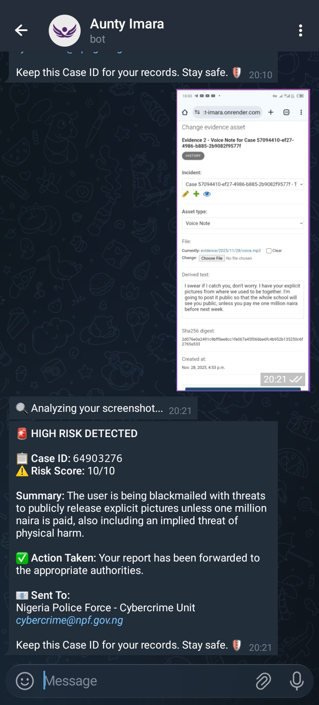
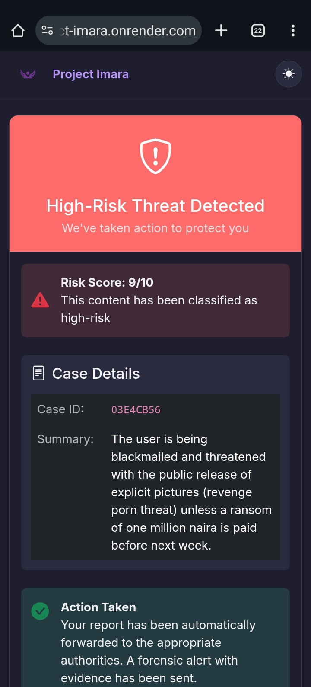
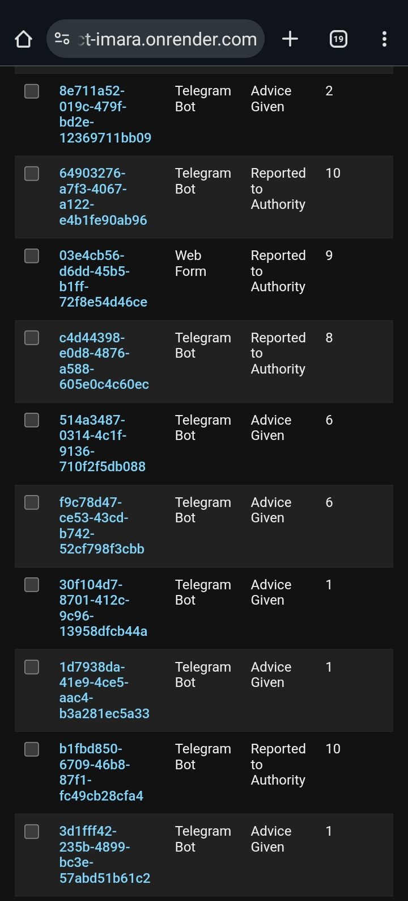
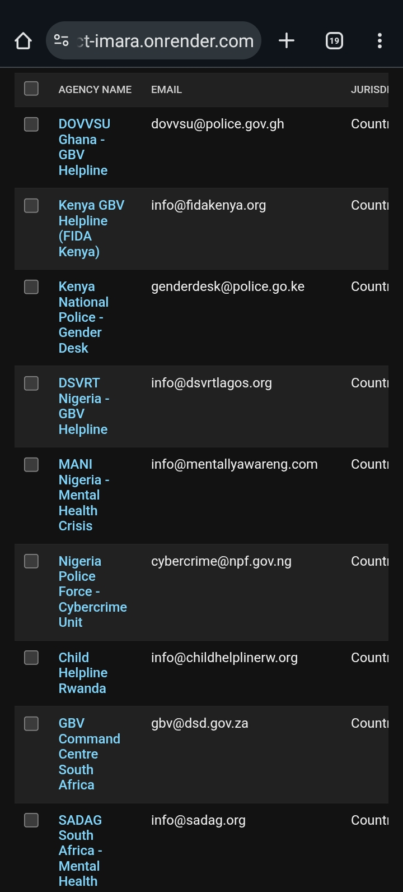
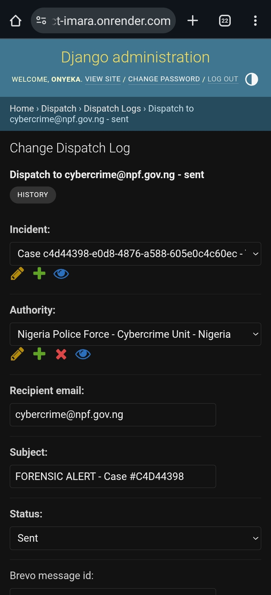
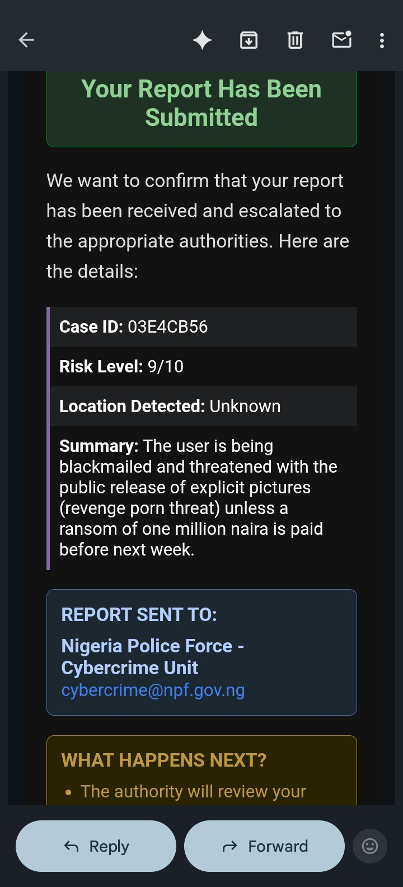

<div align="center">
  
  <h1>Project Imara: The Zero-UI Digital Bodyguard</h1>
  <p><strong>UNiTE to End Digital Violence Against All Women & Girls</strong></p>
  
  <a href="https://imara.africa">
    
  </a>
  <a href="https://t.me/project_imara_bot">
    
  </a>
  <a href="https://docs.google.com/presentation/d/1zAQIrsDssBgPdATzoxVS51R7D_amzc4K9-80rJbeGz4/edit?usp=sharing">
    
  </a>
</div>

<br>

## 🚨 The Problem
70% of women have faced online violence, but reporting it is hard. Most safety apps require a download—leaving a digital trace that abusers can find. **Survivors need protection that is invisible, immediate, and legally robust.**

## 🛡️ The Solution: Zero-UI Architecture
**Imara** is a Digital Bodyguard that lives inside the apps African women already use.
* **No App Download:** Works entirely via Telegram (and Web PWA).
* **Invisible:** Users interact with a bot that looks like a generic news service.
* **Forensic Grade:** Converts screenshots and voice notes into **SHA-256 hashed evidence** admissible in court.

## 🚀 Key Features
1.  **Multi-Modal Intelligence:**
    * **Voice Transcription:** Users can forward **Voice Notes** (from WhatsApp/Telegram) directly to the bot. We use **Groq Whisper** to instantly transcribe dialects and detect hidden threats in audio.
    * **Visual Analysis:** Uses **Gemini 2.5 Flash** to OCR screenshots and detect doxing/harassment in images.
    * **Text Reasoning:** Uses **Llama-3-70b** for context-aware safety planning.

2.  **Smart Conversational Safety:**
    * **Session Context:** Remembers last 10 messages for coherent conversation flow
    * **Localized Language Detection:** Responds in user's language (English, Pidgin, Swahili)
    * **Safe Word Protection:** Type "STOP", "HELP ME", or "EMERGENCY" to halt any active operation
    * **ASK_LOCATION:** When a threat is severe but location unknown, the bot asks for it before reporting

3.  **Automatic Triage & Dispatch:**
    * **Risk Scoring:** AI rates threats 1-10.
    * **Auto-Escalation:** Risk scores >7 automatically notify the appropriate verified support partner organization for the user’s jurisdiction.
    * **Feedback Collection:** Users rate advice helpfulness (thumbs up/down) to improve the system
    
4.  **Real-World Network:**
    * Database pre-seeded with **19+ verified helplines** across Kenya, Nigeria, South Africa, and Ghana.

## 📸 Evidence of Functionality (Live Demo)
We have tested the system end-to-end. Below are screenshots from our live deployment showing inputs from **Voice**, **Web**, and **Text**.

### 1. The User Interface (Zero-UI)
The survivor reports via Telegram (Voice/Text/Image) or our Camouflaged Web Portal.
| Telegram (Image Analysis) | Web Portal (Voice Transcription) |
|:---:|:---:|
|  |  |
| *Bot receives **forwarded screenshot**, transcribes it, and detects blackmail.* | *Web AI analyzes uploaded data and warns the user.* |

### 2. The Backend Brain (Admin)
The system automatically logs incidents, hashes evidence for legal validity, and routes them to partners.
| Incident Reports Log | Partner Directory |
|:---:|:---:|
|  |  |
| *Real-time tracking of cases (Voice, Image, Text from Web, Telegram) with Risk Scores.* | *19+ Pre-seeded helplines across Africa.* |

### 3. The Action (Dispatch)
High-risk threats trigger immediate email dispatch to the relevant partner organization.
| Dispatch System | Email Confirmation |
|:---:|:---:|
|  |  |
| *System logs the forensic alert dispatch (to the assigned partner).* | *Web user is alerted via provided email.* |

## 🛠️ The "Zero-Cost" Tech Stack
We built a production-grade safety ecosystem using 100% free tiers of enterprise tools.

| Component | Technology | Role |
| :--- | :--- | :--- |
| **Backend** | Django 5.0 (Python) | The "Brain" orchestrating logic & security. |
| **Audio Engine** | **Groq Whisper** | **Core Feature:** Instant transcription of voice notes/audio evidence. |
| **Reasoning** | Groq (Llama-3.3) | Instant (<0.5s) text threat analysis. |
| **Vision** | Gemini 2.5 Flash | OCR and image threat detection. |
| **Database** | SQLite (WAL Mode) | Optimized for low-memory 1GB environments. |
| **Storage** | **Cloudflare R2 (S3)** | Secure, forensic-ready evidence storage. |
| **Dispatch** | Brevo API | Transactional emails to partner organizations. |

## 🔮 Roadmap: Coming Soon
We are expanding the **Zero-UI** concept to the 6 most common platforms used by women in Africa:

| Platform | Status | Feature |
| :--- | :--- | :--- |
| **WhatsApp** | 🚧 In Progress | Integration via Twilio Sandbox |
| **Instagram** | ✅ Integrated (Webhook) | DM Threat Monitoring |
| **Facebook** | ✅ Integrated (Webhook) | Messenger Safety Bot |
| **X (Twitter)** | ⏳ Planned | Public Harassment Flagging |
| **TikTok** | ⏳ Planned | Video Comment Analysis |
| **Snapchat** | ⏳ Planned | Ephemeral Evidence Capture |

## 👥 The Team
**Imara** is a flagship project of **Kiri Research Labs**, built by a diverse team committed to the *"Survivor Support"* and *"Transforming Masculinities"* themes.

* **[Onyeka Nwokike](https://github.com/nwokike)**: Technical Architecture and Security.
* **[Betsy Makamu](https://github.com/makamu-okinyi)**: Partnerships and External Communications.
* **[Whitney Wairimu](https://github.com/PixelNjoki)**: Product Roadmap and User Experience.


*Building from Nigeria & Kenya* 🇳🇬 🇰🇪

### Project Structure
```
/
├── imara/                  # Django project settings
│   ├── settings.py
│   ├── urls.py
│   └── wsgi.py
├── cases/                  # Incident reports and evidence models
│   ├── models.py           # IncidentReport, EvidenceAsset
│   └── admin.py
├── partners/               # Partner organizations + portal
│   ├── models.py           # PartnerOrganization, PartnerUser, PartnerInvite
├── dispatch/               # Email dispatch service
│   ├── models.py           # DispatchLog
│   └── service.py          # BrevoDispatcher
├── triage/                 # AI analysis engine
│   ├── clients/
│   │   ├── groq_client.py
│   │   └── gemini_client.py
│   └── decision_engine.py
├── intake/                 # Web and Telegram interfaces
│   ├── views.py            # HomeView, ReportFormView, TelegramWebhookView
│   ├── services.py         # ReportProcessor
│   └── forms.py
├── templates/              # HTML templates
│   ├── base.html
│   └── intake/
│       ├── index.html
│       ├── report_form.html
│       └── result.html
├── static/                 # Static assets
└── test/                  # Test Screenshots
```

## API Endpoints
| Endpoint | Method | Purpose |
|----------|--------|---------|
| / | GET | Landing page |
| /report/ | GET/POST | Report form |
| /result/ | GET | Analysis results |
| /offline/ | GET | PWA offline page |
| /webhook/telegram/ | POST | Telegram webhook |
| /webhook/meta/ | POST | Meta (Messenger/Instagram) webhook |
| /health/ | GET | Health check |
| /ping/ | GET | Keep-alive endpoint |
| /admin/ | GET | Django admin |

## Telegram Bot Commands
- `/start` - Welcome message
- `/help` - Usage instructions
- `/status` - Bot status check

## 🔧 Installation (Local Dev)

```bash
# 1. Clone
git clone https://github.com/nwokike/imara.git

# 2. Install (using uv - recommended)
uv sync

# OR using pip
pip install -e .

# 3. Environment
cp .env.example .env  # Add your API Keys

# 4. Migrate & Seed
python manage.py migrate
python manage.py seed_partners  # Seeds initial partner organizations (helplines)

# 5. Run
python manage.py runserver
```

-----

-----

*© 2025-2026 [Kiri Research Labs](https://kiri.ng). All rights reserved.*
