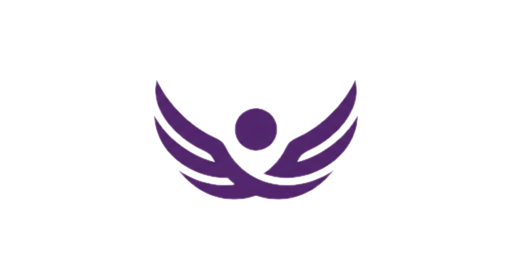

<div align="center">
  
  <h1>Project Imara: The Zero-UI Digital Bodyguard</h1>
  <p><strong>UNiTE to End Digital Violence Against All Women & Girls</strong></p>
  
  <a href="https://imara.africa">
    
  </a>
  <a href="https://t.me/project_imara_bot">
    
  </a>
</div>

<br>

## 🛡️ The Solution: Bodyguard Hive Architecture (2026)
**Imara** is a Digital Bodyguard ecosystem powered by a specialized network of 7 micro-agents.
* **No App Download:** Works entirely via Telegram, Meta (Messenger/Instagram), and Web PWA.
* **Invisible:** Camouflaged interfaces that look like generic news services.
* **Forensic Grade:** Automatic SHA-256 evidence hashing and legally admissible audit trails.

## 🚀 Key Features
1.  **The "Hive" Network (ADK 2026):**
    * **Sentinel:** Enforces safety policies and detects policy violations.
    * **Linguist:** Specialist in African dialects (Pidgin, Swahili) and tonal analysis.
    * **Visionary:** Multimodal OCR and visual threat detection.
    * **Navigator:** High-precision jurisdictional routing across 54 African countries.
    * **Forensic:** Chain-of-custody expert and cryptographic evidence hasher.
    * **Messenger:** Automated drafting of verified alerts for support partners.
    * **Counselor:** The empathetic "Supportive Sister" persona for user-facing dialogue.

2.  **Dual-Pipeline Orchestration:**
    * **Chat Pipeline (Stateful):** History-aware conversations for Telegram and Meta.
    * **Web Pipeline (Stateless):** High-speed batch processing for web form submissions.

3.  **Indestructible Intelligence:**
    * **LiteLLM Router:** 5-layer fallback chain across 32+ models (Groq & Gemini).
    * **Semantic Disk Caching:** Instant reasoning for recurring location and policy queries.

## 🛠️ The 2026 Modern Tech Stack
Optimized for high-concurrency 1GB RAM production environments.

| Component | Technology | Role |
| :--- | :--- | :--- |
| **Framework** | **Django 6.0** | Native async support and optimized task framework. |
| **Web Server** | **Uvicorn (ASGI)** | High-performance async serving (1,000+ concurrent). |
| **Tasks** | **Django Native Tasks** | Lightweight, database-backed background worker. |
| **HTTP Client** | **httpx** | Async-native non-blocking API communication. |
| **Audio/Text** | Groq (Llama 4 / Whisper) | 256k context models for deep history analysis. |
| **Vision** | Gemini 2.5 Pro | Advanced OCR and visual threat classification. |
| **Storage** | Cloudflare R2 | Forensic evidence and automated DB backups. |

## 👥 The Team
**Imara** is a flagship project of **Kiri Research Labs**.

* **[Onyeka Nwokike](https://github.com/nwokike)**: Technical Architecture & AI Safety.
* **[Betsy Makamu](https://github.com/makamu-okinyi)**: Partnerships & Communications.
* **[Whitney Wairimu](https://github.com/PixelNjoki)**: UX & Product Roadmap.

### Project Structure
```
/
├── imara/                  # Django ASGI project settings
├── triage/                 # 7-Agent Hive & Decision Engine
│   ├── agents/             # Sentinel, Linguist, Visionary, etc.
│   └── tasks.py            # Native async orchestration tasks
├── intake/                 # Web, Telegram, and Meta Webhooks
├── cases/                  # Forensic incident & evidence models
├── partners/               # Organization management & Agent Pro
├── dispatch/               # Brevo Email & Forensic Alert service
├── publications/           # Native JSON-to-HTML safety articles
└── static/                 # Minified Tailwind CSS & PWA assets
```

## 🔧 Installation (Local Dev)

```bash
# 1. Clone
git clone https://github.com/nwokike/imara.git

# 2. Setup (Python 3.12+ required)
uv sync

# 3. Environment
cp .env.example .env

# 4. Initialize 2026 Schema
uv run python manage.py migrate
uv run python manage.py seed_partners

# 5. Run Web Server (ASGI)
uv run uvicorn imara.asgi:application --reload

# 6. Run Worker (Background Tasks)
uv run python manage.py db_worker
```

-----
*© 2025-2026 [Kiri Research Labs](https://kiri.ng). All rights reserved.*
