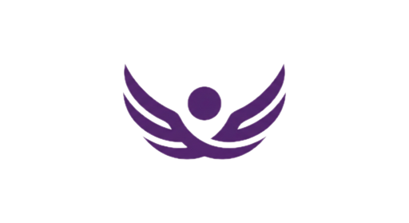
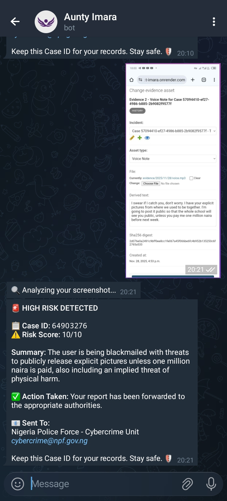
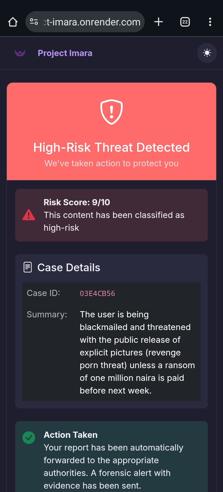
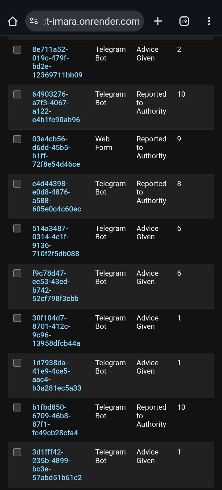
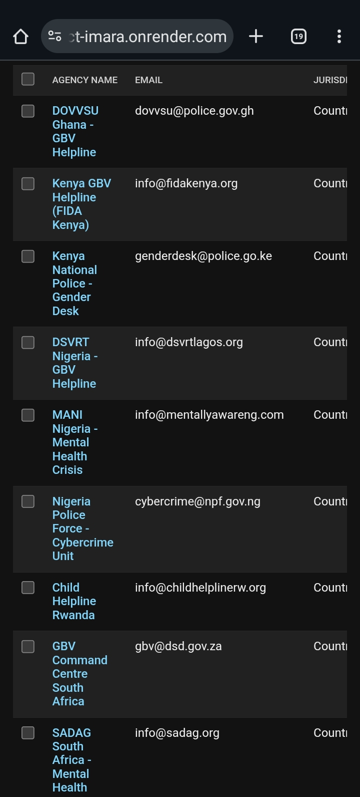
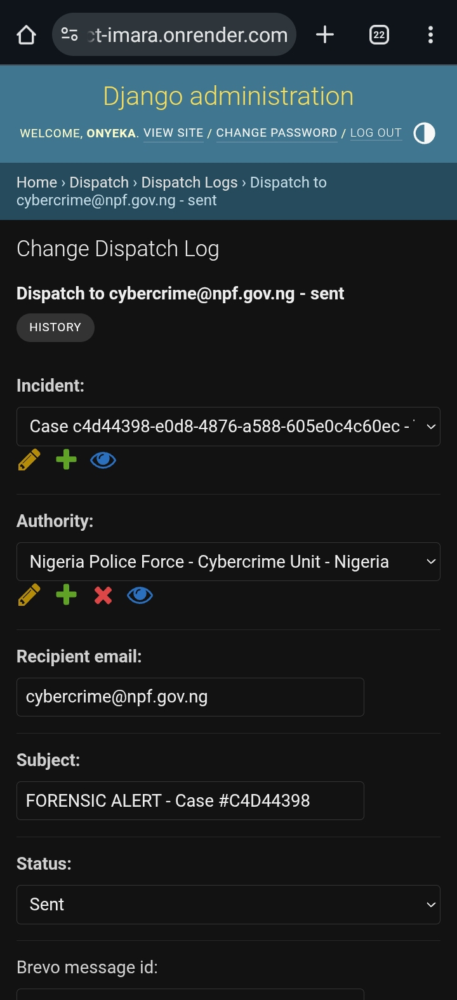
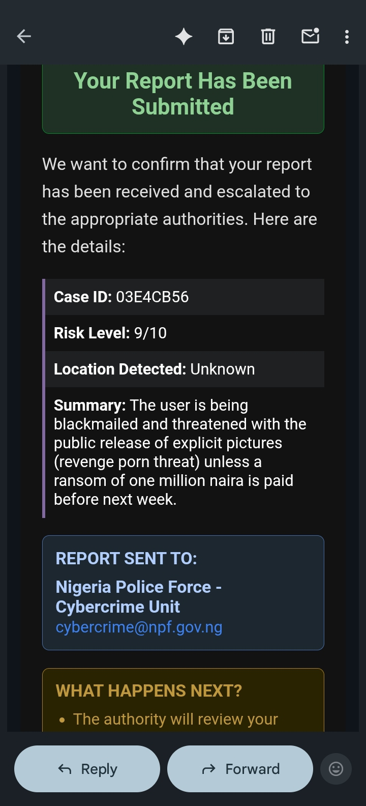

<div align="center">
  
  <h1>Project Imara: The Zero-UI Digital Bodyguard</h1>
  <p><strong>UNiTE to End Digital Violence Against All Women & Girls</strong></p>
  
  <a href="https://project-imara.onrender.com">
    
  </a>
  <a href="https://t.me/project_imara_bot">
    
  </a>
</div>

<br>

> **"Imara"** means *"Strong"* or *"Stable"* in Swahili.

## 🚨 The Problem
70% of women have faced online violence, but reporting it is hard. Most safety apps require a download—leaving a digital trace that abusers can find. **Survivors need protection that is invisible, immediate, and legally robust.**

## 🛡️ The Solution: Zero-UI Architecture
**Imara** is a Digital Bodyguard that lives inside the apps African women already use.
* **No App Download:** Works entirely via Telegram (and Web PWA).
* **Invisible:** Users interact with a bot that looks like a generic news service.
* **Forensic Grade:** Converts screenshots and voice notes into **SHA-256 hashed evidence** admissible in court.

## 🚀 Key Features
1.  **Multi-Modal Intelligence:**
    * **Voice Transcription:** Users can forward **Voice Notes** (from WhatsApp/Telegram) directly to the bot. We use **Groq Whisper** to instantly transcribe dialects and detect hidden threats in audio.
    * **Visual Analysis:** Uses **Gemini 2.5 Flash** to OCR screenshots and detect doxing/harassment in images.
    * **Text Reasoning:** Uses **Llama-3-70b** for context-aware safety planning.
2.  **Automatic Triage & Dispatch:**
    * **Risk Scoring:** AI rates threats 1-10.
    * **Auto-Escalation:** Risk scores >7 automatically email the nearest registered authority (e.g., FIDA Kenya, Cybercrime Unit Nigeria).
3.  **Real-World Network:**
    * Database pre-seeded with **19+ verified helplines** across Kenya, Nigeria, South Africa, and Ghana.

## 📸 Evidence of Functionality (Live Demo)
We have tested the system end-to-end. Below are screenshots from our live deployment showing inputs from **Voice**, **Web**, and **Text**.

### 1. The User Interface (Zero-UI)
The survivor reports via Telegram (Voice/Text/Image) or our Camouflaged Web Portal.
| Telegram (Voice Transcription) | Web Portal (Image Analysis) |
|:---:|:---:|
|  |  |
| *Bot receives **forwarded screenshot**, transcribes it, and detects blackmail.* | *Web AI analyzes uploaded screenshots and warns the user.* |

### 2. The Backend Brain (Admin)
The system automatically logs incidents, hashes evidence for legal validity, and maps them to authorities.
| Incident Reports Log | Authority Database |
|:---:|:---:|
|  |  |
| *Real-time tracking of cases (Voice/Text) with Risk Scores.* | *19+ Pre-seeded helplines across Africa.* |

### 3. The Action (Dispatch)
High-risk threats trigger immediate email dispatch to the relevant authority.
| Dispatch System | Email Confirmation |
|:---:|:---:|
|  |  |
| *System logs the sent email (to Nigerian Police).* | *The user is alerted via email.* |

## 🛠️ The "Zero-Cost" Tech Stack
We built a production-grade safety ecosystem using 100% free tiers of enterprise tools.

| Component | Technology | Role |
| :--- | :--- | :--- |
| **Backend** | Django 5.0 (Python) | The "Brain" orchestrating logic & security. |
| **Audio Engine** | **Groq Whisper** | **Core Feature:** Instant transcription of voice notes/audio evidence. |
| **Reasoning** | Groq (Llama-3) | Instant (<0.5s) text threat analysis. |
| **Vision** | Gemini 2.5 Flash | OCR and image threat detection. |
| **Database** | PostgreSQL (Neon) | Stores evidence with SHA-256 hashes. |
| **Dispatch** | Brevo API | Transactional emails to authorities. |
| **Hosting** | Render | Zero-downtime deployment. |

## 🔮 Roadmap: Coming Soon
We are expanding the **Zero-UI** concept to the 6 most common platforms used by women in Africa:

| Platform | Status | Feature |
| :--- | :--- | :--- |
| **WhatsApp** | 🚧 In Progress | Integration via Twilio Sandbox |
| **Instagram** | ⏳ Planned | DM Threat Monitoring |
| **Facebook** | ⏳ Planned | Messenger Safety Bot |
| **X (Twitter)** | ⏳ Planned | Public Harassment Flagging |
| **TikTok** | ⏳ Planned | Video Comment Analysis |
| **Snapchat** | ⏳ Planned | Ephemeral Evidence Capture |

## 👥 The Team
**Imara** was built by a diverse team committed to the *"Survivor Support"* and *"Transforming Masculinities"* themes.

* **[Onyeka Nwokike](https://github.com/nwokike)**: Backend Architecture & AI Engineer.
* **[Betsy Makamu](https://github.com/makamu-okinyi)**: Frontend Engineering & UI/UX.
* **[Pixel Njoki](https://github.com/PixelNjoki)**: Research Lead & Strategy.

*Building from Nigeria & Kenya* 🇳🇬 🇰🇪

## 🔧 Installation (Local Dev)

```bash
# 1. Clone
git clone [https://github.com/nwokike/imara.git](https://github.com/nwokike/imara.git)

# 2. Install
pip install -r requirements.txt

# 3. Environment
cp .env.example .env  # Add your API Keys

# 4. Migrate & Seed
python manage.py migrate
python manage.py seed_authorities  # Loads the 19+ helplines

# 5. Run
python manage.py runserver
````

-----

*Built for Power Hacks 2025. United to End Digital Violence.*
