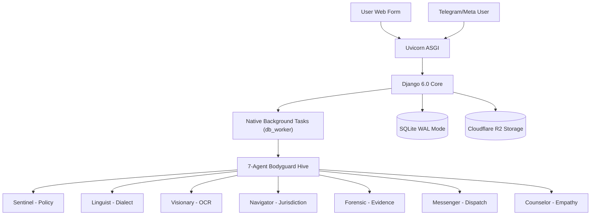

# Project Imara - Zero-UI Digital Bodyguard (2026 Technical Standard)

## Overview
**A project of Kiri Research Labs**

Project Imara is a specialized "Bodyguard Hive" platform protecting African women from digital violence. The 2026 architecture is optimized for low-memory environments (1GB RAM) while providing enterprise-grade multi-agent reasoning.

## Architecture: The "Hive" Network


## API Endpoints
- `/` - Landing page
- `/report/` - Stateless web report form
- `/webhook/telegram/` - Async Telegram bot webhook
- `/webhook/meta/` - Unified Meta (Facebook/Instagram) webhook
- `/health-check/` - ASGI service health status

## Environment Variables (2026 Production)

**Django Core:**
- `SECRET_KEY`: Django secret (required)
- `DEBUG=False`: Production safety toggle
- `ALLOWED_HOSTS`: Allowed domains/IPs
- `CSRF_TRUSTED_ORIGINS`: Required for production form submissions
- `SECURE_PROXY_SSL_HEADER`: Required for GCP HTTPS offloading

**AI Orchestration (LiteLLM):**
- `GROQ_API_KEY`: Main reasoning & audio engine
- `GEMINI_API_KEY`: Visual & fallback expert
- `LITELLM_LOG`: Router debugging levels

**Forensic Services:**
- `BREVO_API_KEY`: Transactional email for partner alerts
- `R2_ACCESS_KEY_ID`, `R2_SECRET_ACCESS_KEY`: Cloudflare R2 credentials
- `R2_BACKUP_BUCKET_NAME`: Dedicated bucket for database snapshots

**Bot Security:**
- `TURNSTILE_SITE_KEY`, `TURNSTILE_SECRET_KEY`: Cloudflare Turnstile CAPTCHA
- `TELEGRAM_BOT_TOKEN`: Bot identification
- `META_APP_SECRET`: Webhook signature verification

## Runtime Optimization (1GB VM)

**High-Performance Serving:**
- **Uvicorn (ASGI)**: Optimized for non-blocking I/O.
- **Native db_worker**: Replaces Huey/Celery. Zero external dependencies (Redis/RabbitMQ) required.
- **SQLite WAL Mode**: High concurrency support for file-based storage.

**Data Retention Policy:**
- **Chat History**: Pruned every 90 days (`TRIAGE_MESSAGE_RETENTION_DAYS`).
- **Forensic Records**: Permanent. Includes SHA-256 evidence digests and jurisdictional audit logs.

## Operational Runbook (Production)

### Service Management (systemd)
```bash
# Restart Web Server
sudo systemctl restart imara

# Restart Background Worker
sudo systemctl restart imara-worker

# Check Service Status
systemctl status imara imara-worker
```

### Database Maintenance
- **Backups**: Automatically uploaded to R2 daily via `backup_database_task`.
- **Restore**:
  1. Stop services: `sudo systemctl stop imara imara-worker`
  2. Sync snapshot from R2 to `db.sqlite3`.
  3. Start services: `sudo systemctl start imara imara-worker`

## Key Implementation Patterns
1. **Bodyguard Hive**: "One Agent, One Tool" pattern ensures logic is modular and models are specialized.
2. **Dual-Pipeline**: 
   - `chat_orchestration`: Stateful, history-aware (Telegram/Meta).
   - `web_orchestration`: Stateless, high-speed batch (Web Form).
3. **ContextBundle**: Standardized object for sharing artifacts across agent hops without RAM bloating.
4. **Agent Pro**: Partner-specific AI settings for customized organizational personas.

-----
*Technical standard enforced by Gemini CLI - Feb 2026.*
